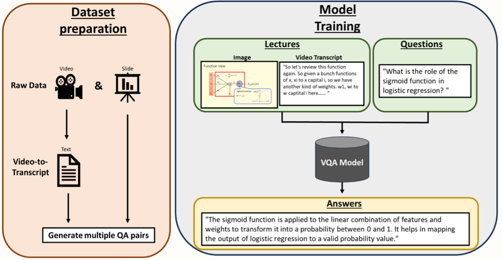

## Visual Question Answering (VQA) System Video Understanding of ML Classes
The goal of this study is to create a custom dataset and develop a Visual Question Answering (VQA) model that utilizes multiple modes of input.

## Workflow

